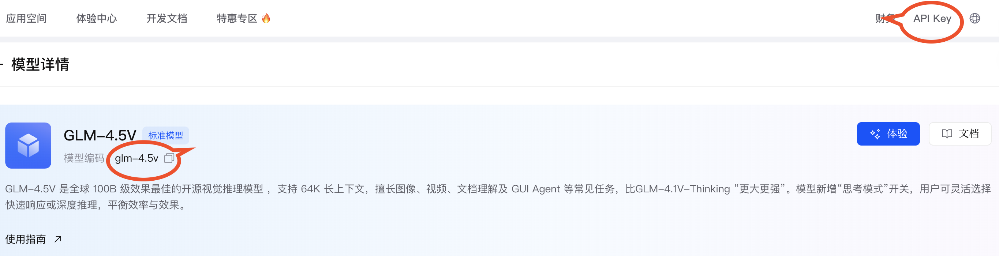

# jin_ai_generator

一个简单的国内大模型调用库，百 度千帆、阿里百炼、智谱BigModel等平台

## 功能特点

- 开箱即用：只需要到对应平台申请API Key，即可使用
- 简单统一的AI生成器接口设计
- 很容易试用不同的AI模型
- 支持文生文

## 支持的AI模型

| 提供商           | 模型名称         | 实现类 |
|---------------|--------------|--------|
| 百度千帆          | ERNIE 3.5 8K | `QianfanAIGenerator` |
| 阿里百灵          | Qwen Plus    | `BailianAIGenerator` |
| BigModel      | GLM-4-5-Air  | `BigModelAIGenerator` |
| 兼容 OpenAI 的模型 | /            | `OpenAIAIGenerator` |

## 大模型平台

[阿里百炼 api 平台:  Bailian](https://bailian.console.aliyun.com/?tab=model#/model-market)


[智谱 AI api 平台：BigModel](https://bigmodel.cn/console/modelcenter/square)
需要登录，申请API Key，选择想要的大模型 key。
有免费的模型



[百度千帆 api 平台：Qianfan](https://console.bce.baidu.com/qianfan/modelcenter/model/buildIn/list)
是个模型市场，但是模型 id 为什么不能想起他模型市场一样，很容易找到呢？


惨绝人寰，别人可以在市场界面就能找到模型 id，它非要跳四个页面才能找到模型ID


## 安装

在`pubspec.yaml`中添加依赖：

```yaml
dependencies:
  jin_ai_generator:
```

然后运行：

```bash
flutter pub get
```

## 使用方法

### 初始化AI生成器

```dart
// 初始化百度千帆生成器
model = AiGenerator.createQianfanWith_ernie_3_5_8k(
  apiKey: 'your_qianfan_api_key',
);

model = AiGenerator.createBigModelWith(
  apiKey: "your_bigmodel_api_key",
  model: BigModelAIGenerator.MODEL_glm_z1_flash,
),


```

### 生成文本

```dart
final String result = await model.generate(
  '请写一首关于春天的诗',
  systemPrompt: '你是一位诗人，擅长创作优美的诗歌',
  maxTokens: 500,
);
print(result);
```

### 释放资源

```dart
model.close();
```

## 项目结构

```
lib/
├── i_ai_generator.dart      # AI生成器接口定义
├── openai_ai_generator.dart # 兼容 OpenAI api 的实现
├── qianfan_ai_generator.dart # 百度千帆实现
├── bailian_ai_generator.dart # 阿里百炼实现
└── big_model_ai_generator.dart # BigModel实现
```

## 开发指南

### 运行测试

```bash
flutter test
```


### 添加新的AI模型

1. 创建新的实现类，实现`AiGenerator`接口
2. 在`i_ai_generator.dart`中添加对应的工厂方法
3. 实现具体的API调用逻辑


## License

MIT License 
